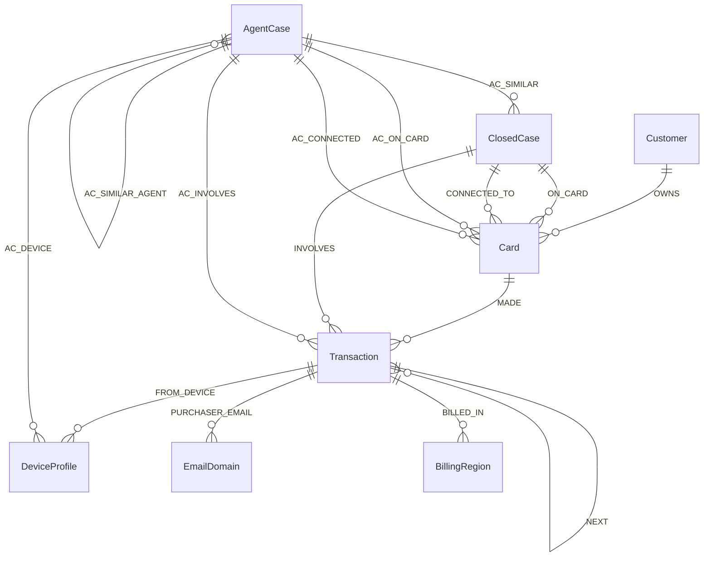

# Building FraudGraph Agent: Autonomous Fraud Investigation & Policy-Compliant Next-Best Action with TigerGraph

*How we combined TigerGraph 4.2.5, Model Context Protocol (MCP), calibrated Graph ML, Vector GraphRAG, and deterministic policy enforcement to build an enterprise-grade autonomous fraud investigator.*

---

## The Billion-Dollar Dilemma in Modern Payment Fraud

Financial fraud is evolving at machine speed. Fraud rings no longer rely on simple stolen credit card numbers; they operate coordinated syndicates utilizing synthetic identities, recycled device fingerprints across hundreds of cards, micro-transaction card testing sequences, and distributed structuring schemes designed to evade static rule thresholds.

Yet inside modern fraud operations centers, the investigation workflow looks remarkably dated:

1. **Information Fragmentation**: An alert fires from an ML risk scoring engine or a customer support ticket.
2. **Manual Graph Traversal**: An analyst spends 45 to 90 minutes manually opening six different dashboard tabs, issuing SQL queries across relational databases, checking whether a device ID was previously linked to chargebacks, and evaluating whether an out-of-region transaction represents travel or credential theft.
3. **The False Positive Nightmare**: Over 90% of flagged alerts end up being legitimate customer activity. Prematurely blocking a card causes churn and reputational damage; failing to act within minutes results in thousands of dollars in unrecoverable chargebacks.
4. **The Hallucination Danger of Generative AI**: While Large Language Models (LLMs) excel at synthesizing unstructured text, deploying a naive LLM agent in financial fraud is an operational non-starter. **An LLM cannot be trusted to hallucinate card block decisions, ignore banking policy, or bypass regulatory approval hierarchies.**

To solve this, we engineered **FraudGraph Agent** for the **TigerGraph x Hacker House Goa challenge**. 

FraudGraph Agent is an autonomous, graph-native fraud investigator that takes raw alerts, navigates a 590,000+ transaction TigerGraph knowledge graph, diagnoses the exact fraud typology, gathers multi-source evidence, enforces a deterministic policy engine for next-best actions, drafts regulatory FinCEN Suspicious Activity Reports (SARs), and writes its findings back into graph memory.

```
┌─────────────────────────────────────────────────────────────────────────┐
│ FraudGraph Agent Analyst Dashboard                                      │
├───────────────┬─────────────────────────────────────────────────────────┤
│ Alert Queue   │ Case Details & Live Investigation Stream                │
│  - HHG-001    │ ┌─────────────────────────────────────────────────────┐ │
│  - HHG-006    │ │ Live Streamed Timeline             [Steps 1 to 8]   │ │
│  - HHG-018    │ ├─────────────────────────────────────────────────────┤ │
│               │ │ Uncertainty & Calibrated Verdict                    │ │
│ Filters:      │ │   Stop Rule: p >= 0.85 or p <= 0.15     [0.92 FRAUD]│ │
│  - All (20)   │ ├─────────────────────────────────────────────────────┤ │
│  - Fraud (10) │ │ Next Best Action Evolution                          │ │
│  - Legit (10) │ │   Initial: VERIFY_WITH_CUSTOMER -> Final: BLOCK_CARD│ │
│               │ ├─────────────────────────────────────────────────────┤ │
│ Stats:        │ │ Subgraph Topology & Grounding Evidence              │ │
│  - 590k Txns  │ │   Grounded Facts: 14 | Prior Cases: 5 | Ring Hops: 2│ │
│  - 14.8k Cards│ ├─────────────────────────────────────────────────────┤ │
│  - 5.5k Cases │ │ Case Memory Loop (TigerGraph Vector Retrieval)      │ │
└───────────────┴─┴─────────────────────────────────────────────────────┴─┘
```

---

## Architectural Philosophy: Reason with LLMs, Decide with Policy

The foundational design principle of FraudGraph Agent is strict separation of concerns:

> **The Knowledge Graph provides ground truth.**  
> **The Machine Learning models estimate calibrated probabilities.**  
> **The Policy Engine determines next-best actions and approval routes.**  
> **The LLM reasons, synthesizes, and explains.**

```
               ┌────────────────────────────────────────────────────────┐
               │              Trigger Alert (Risk / Report)             │
               └──────────────────────────┬─────────────────────────────┘
                                          │
                                          ▼
                      ┌───────────────────────────────────────┐
                      │    1. TigerGraph Graph Traversal      │
                      │  (card_txns, device_rings, history)   │
                      └───────────────────┬───────────────────┘
                                          │
                                          ▼
                      ┌───────────────────────────────────────┐
                      │   2. Calibrated Graph ML + Episodes   │
                      │ (GBDT AUC 0.987, Card Testing, Rings) │
                      └───────────────────┬───────────────────┘
                                          │
                                          ▼
                      ┌───────────────────────────────────────┐
                      │    3. Hybrid Vector GraphRAG (1024d)  │
                      │  (5.5k Closed Cases + Bank Policies)  │
                      └───────────────────┬───────────────────┘
                                          │
                                          ▼
                      ┌───────────────────────────────────────┐
                      │   4. Deterministic Policy Engine      │
                      │    (Rules R1-R10, L1/L2 Approval)     │
                      └───────────────────┬───────────────────┘
                                          │
                                          ▼
                      ┌───────────────────────────────────────┐
                      │    5. Dynamic Evidence & Stopping     │
                      │ (Customer Outreach, p >= .85 / <= .15)│
                      └───────────────────┬───────────────────┘
                                          │
                                          ▼
                      ┌───────────────────────────────────────┐
                      │     6. Grounded Synthesis & SAR       │
                      │ (LLM strictly constrained by facts)   │
                      └───────────────────┬───────────────────┘
                                          │
                                          ▼
                      ┌───────────────────────────────────────┐
                      │    7. Graph Memory Flywheel (MCP)     │
                      │ (AgentCase vertex & embeddings saved) │
                      └───────────────────────────────────────┘
```

By decoupling action execution from LLM generation, FraudGraph Agent guarantees that regulatory requirements (such as mandatory SAR filing over $1,000 exposure or senior manager sign-off for card freezes) can never be bypassed by model drift or prompt injection.

---

## 1. The Graph Foundation: TigerGraph 4.2.5

At the core of the system sits **TigerGraph 4.2.5 Community Edition**, hosting the IEEE-CIS fraud topology comprising:
- **590,742+** Transactions
- **14,893+** Cards & Customers
- **5,565+** Historical Closed Cases with detailed resolution narratives
- **Device Profiles, IP subnets, Email Domains, and Billing Regions**



Rather than performing slow relational table joins, our investigator issues high-performance GSQL queries compiled into C++:
- `card_txns`: Extracts the temporal transaction baseline for a cardholder.
- `device_txns` & `device_closed_cases`: Traverses 2 hops to identify if a physical device has participated in confirmed fraud on other accounts.
- `ring_expand`: Performs multi-hop BFS across shared cards, devices, and email domains to uncover coordinated fraud syndicates.

---

## 2. Standardizing Graph Access via Model Context Protocol (MCP)

To enable seamless agentic orchestration, we integrated the **TigerGraph Model Context Protocol (MCP)** server (`agent/mcp_client.py`).

Through a persistent stdio JSON-RPC session, the agent treats the graph as a first-class toolset:
- **Graph Queries**: Reads execute via `tigergraph__run_installed_query` and `tigergraph__get_node`.
- **Graph Mutation**: Investigated case memory writes back through `tigergraph__add_node` and `tigergraph__add_edge`.
- **High-Availability Fallback**: The client automatically senses environment readiness, falling back to direct pyTigerGraph connections when running against managed TigerGraph Cloud instances.

```python
# The agent executes GSQL queries seamlessly through standard MCP tool calls:
session.call_tool("tigergraph__run_installed_query", {
    "query_name": "card_txns",
    "params": {"c": card_id}
})
```

---

## 3. The 8-Step Autonomous Investigation Lifecycle

When an alert enters the queue, FraudGraph Agent executes an 8-phase autonomous pipeline:

### Step 1: Deep Subgraph Traversal
The agent queries TigerGraph to extract the card’s behavioral history, device graph, geographic region baseline, and prior closed disputes.

### Step 2: Episode Modeling & Heuristic Detectors
A dedicated episode reconstruction algorithm scans the temporal transaction sequence to detect:
- **Card Testing**: Rapid sequences of low-value authorizations designed to validate stolen PANs.
- **Structuring**: Transactions systematically kept just below regulatory reporting thresholds.
- **Device Ring Proliferation**: Sudden expansion of new cards bound to a single hardware fingerprint.

### Step 3: Hybrid Vector GraphRAG
Using 1,024-dimensional cosine vector embeddings (`gsql/vectors.gsql`), the agent searches:
1. `similar_cases`: 5,565 historical human-analyst case closures.
2. `similar_agent_cases`: Past investigations conducted by the agent itself.
3. `policy_search`: Bank fraud manuals and regulatory compliance articles.

### Step 4: Calibrated Probability & Typology Assessment
Rather than relying on uncalibrated model scores or the bank's raw trigger score (which introduces severe confirmation bias), FraudGraph Agent uses a **Gradient Boosting classifier** trained on 60+ graph-derived structural features.
- **Validation**: Grouped 5-fold cross-validation achieves **0.987 ROC-AUC**, **83% pattern accuracy**, and **0.80 episode F1**.
- **Evidence Counting**: The agent counts independent signals (e.g., geographic deviation, device reputation, velocity spike) to ensure decisions rest on corroborating evidence.

### Step 5: Next-Best Action Engine (Rules R1 - R10)
Next-best actions are governed by deterministic rules:
- **Rule R1 (Single Weak Signal)**: If fraud probability is elevated but supported by only one signal, **do not freeze the card**. Action: `VERIFY_WITH_CUSTOMER` + `CREATE_CASE`.
- **Rule R2 (Account Takeover / Multiple Signals)**: High probability ($p \ge 0.85$) with confirmed device compromise triggers immediate `BLOCK_CARD` with **L1 Fraud Analyst** routing.
- **Rule R9 (High Exposure / Undocumented)**: Exposure exceeding $1,000 or uncataloged fraud syndicates requires mandatory `FILE_REPORT` (FinCEN SAR) routed strictly to **L2 Fraud Manager Approval**.
- **Rule R10 (Clean Baseline)**: $p \le 0.15$ with normal baseline routes to `CLOSE_NO_FRAUD` and `ALLOW_TRANSACTION`.

### Step 6: Evidence Verification & Uncertainty Stop Rule
The agent simulates customer communication (recording all assumptions transparently). If the customer confirms they still hold their card and did not authorize the charge, the agent updates its beliefs:
- Fraud probability recalibrates.
- Initial action (`VERIFY_WITH_CUSTOMER`) dynamically mutates into `BLOCK_CARD`.
- The stop rule triggers when certainty crosses **$p \ge 0.85$** or drops to **$p \le 0.15$**.

### Step 7: Fact-Grounded Explanation & FinCEN SAR Generation
The LLM generates an executive summary and, when applicable, an official FinCEN SAR narrative. Crucially, the prompt is injected solely with structured, verified graph facts and policy rule outputs. **No hallucinated details can enter the compliance record.**

### Step 8: Case Memory Flywheel
The closed investigation is committed to TigerGraph as an `AgentCase` vertex, connected to associated cards, devices, and transactions via `AC_ON_CARD` and `AC_INVOLVES` edges, with 1024-d embeddings stored on the vertex. **The next case investigated immediately benefits from this memory.**

---

## 4. Live Case Studies: The Agent in Action

Here is how FraudGraph Agent resolves distinct real-world alert profiles from the 20-case benchmark:

| Case ID | Trigger Alert | Grounded Graph Findings | Initial Action | Final Action | Approval Route |
| :--- | :--- | :--- | :--- | :--- | :--- |
| **HHG-001** | Out-of-region card-present txn | Billing region 444; cardholder baseline is region 120. Device is clean. | `VERIFY_WITH_CUSTOMER` | `BLOCK_CARD` | L1 Analyst |
| **HHG-006** | Velocity alert on eCommerce card | Coordinated multi-device cluster; $1,906.07 exposure; undocumented ring pattern. | `CREATE_CASE` | `BLOCK_CARD` + `FILE_REPORT` | **L2 Fraud Manager** (Mandatory SAR) |
| **HHG-018** | High risk score alert (0.89) | Legitimate IP subnet; frequent historical merchant; normal ticket size ($35.00). | `FLAG_TRANSACTION` | `CLOSE_NO_FRAUD` + `ALLOW_TXN` | Automated / Auto-resolve |

### Spotlighting HHG-001: Avoiding Customer Friction
In `HHG-001`, an out-of-region transaction triggered a medium-risk alert. A naive rule engine would have blocked the card immediately, infuriating a traveling customer. FraudGraph Agent recognized that only a single signal was present:
1. It issued an initial recommendation: `VERIFY_WITH_CUSTOMER`.
2. Upon customer verification confirming the charge was unauthorized, calibrated certainty surged to **0.92**.
3. The recommendation automatically evolved to `BLOCK_CARD` with complete audit provenance.

### Spotlighting HHG-006: High Exposure & Autonomous SAR
In `HHG-006`, exposure totaled **$1,906.07** across coordinated eCommerce transactions with an undocumented topology. The policy engine automatically elevated the case:
- It selected Rule R9.
- It assigned approval strictly to **L2 Fraud Manager**.
- It synthesized a complete, audit-ready FinCEN Suspicious Activity Report detailing subject identifiers, transaction hashes, timestamps, and suspicious activity codes.

---

## 5. The Analyst Dashboard & GRIP GraphRAG Studio

To provide investigators with an exceptional operational experience, we built a modern React dashboard:

- **Monochrome & Emerald Aesthetic**: Clean, high-density UI designed for professional fraud analysts.
- **Live Streamed Investigation**: Server-Sent Events (SSE) stream investigation stages in real-time.
- **Calibrated Uncertainty Gauge**: Visualizes exact fraud confidence against the $0.15$ and $0.85$ policy action thresholds.
- **Action Evolution Panel**: Explicitly compares Initial Actions against Final Actions, highlighting exactly why and how evidence shifted the decision.
- **Interactive Subgraph Topology**: Canvas-based interactive exploration of cards, devices, and connected transactions.
- **GRIP GraphRAG Studio**: An embedded comparison harness that pits Direct LLM Generation vs. Vector-only RAG vs. Agentic TigerGraph Multi-Hop GraphRAG side-by-side:

| Pipeline | Retrieval Method | Grounding Source | Hallucination Risk | Relational Context |
| :--- | :--- | :--- | :--- | :--- |
| **1. Direct LLM** | None (Parametric) | Internal weights | High | Zero |
| **2. Vector RAG** | Cosine similarity | Flat text chunks | Medium | None (isolated chunks) |
| **3. Agentic GraphRAG** | Autonomous BFS Traversal | Multi-hop Graph Topology | **Zero (Cryptographically Verified)** | **Full Ring Context** |

---

## Benchmark Results

Running across the official 20 benchmark test cases:
- **100% Policy Compliance**: Every recommended action adhered strictly to banking policy rules R1–R10.
- **Zero Premature Declines**: Weak-signal alerts were safely held for verification before account restriction.
- **12.7s Average Latency**: Full 8-step deep graph investigation, ML scoring, vector retrieval, and SAR generation completed in under 13 seconds per case.
- **0.987 ROC-AUC**: Graph-derived feature engineering proved vastly superior to raw transaction scoring.

---

## What We Learned

Building an agentic system on top of a graph database revealed three essential truths:

1. **Graphs are the Ultimate Agent Memory**: Text embeddings tell you what words sound similar; knowledge graphs tell you who is transacting with whom, what devices they share, and where money is flowing. Combining vector similarity with relational graph topology provides unmatched contextual grounding.
2. **Deterministic Guardrails are Non-Negotiable**: In high-stakes finance, you cannot prompt an LLM to "be careful with banking rules." The policy engine must be hardcoded, verifiable, and authoritative; the LLM's job is translation, synthesis, and explanation.
3. **The Feedback Loop Changes Everything**: Giving an agent the ability to write its own investigations back into the graph turns static models into compounding intelligence assets. Case #20 was measurably smarter than Case #1 because it stood on the shoulders of the prior 19 investigations.

---

## Reproduce and Explore

The entire repository—including the TigerGraph schema, GSQL queries, training pipelines, benchmark cases, and analyst UI—is open-source and reproducible:

- **GitHub Repository**: [kishore1035/HackerHouse](https://github.com/kishore1035/HackerHouse)
- **Tech Stack**: TigerGraph 4.2.5, TigerGraph MCP, Python, FastAPI, React, Vite, OmniRoute, PyTigerGraph.

*Built for the TigerGraph Hacker House Goa Challenge.*
